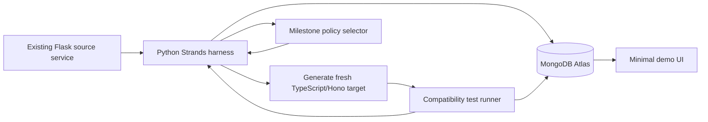

# PortPilot: 4-Hour Hackathon Charter

## Project statement

PortPilot is a self-improving, MongoDB Atlas-backed AI harness for behavior-preserving legacy-service migration.

It takes an existing Python/Flask service as input and creates a new TypeScript/Hono service from scratch. It analyzes source behavior, generates the target, runs compatibility tests, records evidence durably, and improves its migration policy when tests expose a missed behavioral rule.

PortPilot is not a universal code translator. It demonstrates that an agent harness can make a small but risky migration safer, resumable, and measurably better over repeated runs.

## Real-world problem

A service becomes legacy because its behavior, dependencies, deployment, and ownership have become difficult to maintain—not because its framework is automatically obsolete.

An organization may migrate an existing Flask service to its TypeScript platform to consolidate backend tooling, deployment practices, observability, and developer expertise. The risk is that the old service contains undocumented behavior relied upon by clients.

That behavior can include:

- error status codes and response schemas;
- input coercion and default values;
- validation edge cases;
- field transformations;
- backward-compatible quirks.

The costly failure is not a target service that fails to compile. It is one that deploys successfully while silently changing production behavior.

## Hackathon themes addressed

| Theme | PortPilot demonstration |
| --- | --- |
| Recursive Harnessing | A failed migration produces a candidate migration policy/skill. The harness evaluates it against the prior policy and promotes or rejects it using recorded metrics. |
| Long Horizon Engineering | Migration runs, milestones, artifacts, test evidence, policy decisions, and checkpoints persist in MongoDB Atlas. A paused run resumes without rediscovering prior work. |

## Fixed demo scenario

### Input legacy service

A small existing Python/Flask Profile Normalization API with two or three endpoints:

- `POST /profiles/normalize`
- `POST /profiles/validate`
- `GET /profiles/:id`

The source has compatibility-sensitive behavior:

- numeric strings are coerced in a particular way;
- invalid payloads return HTTP `422`, rather than `400`;
- error responses follow a nested JSON schema;
- omitted optional fields receive defaults.

### Generated target service

PortPilot begins each migration with only the Flask source and its behavioral contract. It creates a new empty TypeScript/Hono project and generates the target service from scratch.

Hono is a small TypeScript web framework, similar in purpose to Flask or Express. It is a practical target for a Python-to-TypeScript migration; PortPilot does not claim that Hono is automatically faster than Flask.

### Compatibility suite

A small suite of 8–10 tests calls the source and generated target services and compares:

- HTTP status codes;
- JSON response bodies;
- defaulting and coercion behavior.

The first migration policy, v1, is expected to miss at least one compatibility-sensitive behavior. The resulting failure becomes evidence for a better policy.

## Required scope

### A. Controlled source fixture and contract tests

- [ ] Build the Flask source service.
- [ ] Build a compatibility test runner.
- [ ] Define 8–10 behavioral contract cases.
- [ ] Verify that the source service passes its own contract suite.

Done when the test runner clearly reports source behavior and can compare a generated target against it.

### B. Durable MongoDB Atlas state

Use the hackathon MongoDB Atlas Sandbox as the system of record.

Persist:

- [ ] `migration_runs`: run ID, status, current milestone, timestamps.
- [ ] `milestones`: source analysis, generation, test, diagnosis, evaluation, completion.
- [ ] `artifacts`: source analysis, generated target version, test output, diagnosis.
- [ ] `policies`: versioned migration policies/skills and promotion decisions.
- [ ] `events`: tool calls, decisions, failures, and checkpoint events.

Done when refreshing the application does not lose run state, generated-artifact references, test evidence, or active policy version.

### C. Strands migration harness

Use Python and the Strands Agents SDK as the agent runtime.

Implement a small, bounded tool set:

- [ ] `inspect_source`: reads source behavior and relevant files.
- [ ] `generate_target`: creates a new TypeScript/Hono target from an empty template.
- [ ] `run_contract_tests`: compares the source and target behavior.
- [ ] `diagnose_failure`: converts failed tests into a structured failure category.
- [ ] `create_candidate_policy`: creates a versioned migration policy/skill.
- [ ] `evaluate_policy`: compares v1 and v2 migration results.
- [ ] `persist_checkpoint`: saves resumable progress to Atlas.

For each milestone, the harness supplies only the relevant tools and active policy. Tool implementations live in application code; Atlas stores manifests, permissions, selection history, policies, and evidence.

Done when a migration run produces persisted milestones and tool events in Atlas.

### D. Policy-improvement loop

The initial migration policy, v1, does not explicitly require preservation of legacy validation status and error schemas.

After a failed compatibility test:

- [ ] create candidate policy v2;
- [ ] record the failure rationale;
- [ ] create a fresh empty target directory;
- [ ] rerun the complete migration from the original Flask source under v2;
- [ ] compare v1 and v2 contract-test pass rates;
- [ ] promote v2 only when it improves results and introduces no regression;
- [ ] retain v1 for evidence and rollback.

Done when Atlas shows v1 and v2, the recorded evaluation, a promotion decision, and an improved generated target.

### E. Durable pause and resume

- [ ] Pause a run after test diagnosis or candidate-policy creation.
- [ ] Persist the current milestone and artifacts in Atlas.
- [ ] Resume using only the saved run ID.
- [ ] Continue without repeating completed source analysis.

Done when the demo visibly pauses, reloads, resumes, and completes from an Atlas checkpoint.

### F. Minimal demonstration interface

Build a minimal interface or clean terminal flow that can:

- [ ] start a migration run;
- [ ] show the current milestone and test result;
- [ ] pause and resume by run ID;
- [ ] show policy v1 versus v2 evidence;
- [ ] show the final generated target passing the previously missed behavior.

The interface is supporting evidence, not the main feature.

## Architecture

## Technology choices

| Layer | Choice | Reason |
| --- | --- | --- |
| Agent runtime | Python + Strands Agents SDK | Provides agent execution and tool calling while leaving policy, persistence, evaluation, and guardrails under project control. |
| Model gateway | OpenRouter | Uses hackathon model credits with flexible model choice. |
| Durable state | MongoDB Atlas Sandbox | Core record of migration runs, artifacts, policies, test evidence, and checkpoints. |
| Migration path | Python Flask to TypeScript Hono | Makes the language and platform migration clear while remaining small enough to complete. |
| Interface | Thin web UI or terminal presentation | Supports the demo without becoming a dashboard project. |

## Four-hour execution plan

| Time | Deliverable | Stop condition |
| --- | --- | --- |
| 0:00–0:20 | Credentials, repository skeleton, Atlas connection | Atlas read/write smoke test works. |
| 0:20–1:00 | Flask fixture and compatibility test runner | Source behavior is covered by 8–10 tests. |
| 1:00–1:40 | Atlas persistence layer | Runs, milestones, artifacts, and tests persist. |
| 1:40–2:25 | Strands agent and bounded tools | Agent can inspect, generate, test, diagnose, and persist. |
| 2:25–3:05 | Policy v1/v2 evaluation loop | A fresh v2 port improves a failed behavior. |
| 3:05–3:30 | Pause/resume | Saved run resumes from Atlas checkpoint. |
| 3:30–3:50 | Minimal presentation interface | Full narrative can be shown in sequence. |
| 3:50–4:00 | Rehearsal, README, demo recording | Three-minute demo works twice in a row. |

## Success criteria

- [ ] MongoDB Atlas Sandbox is the persistent system of record.
- [ ] PortPilot accepts Flask source and creates a fresh TypeScript/Hono target.
- [ ] The first migration produces compatibility evidence.
- [ ] A failed behavior creates a versioned candidate migration policy.
- [ ] v1 and v2 are evaluated with recorded metrics.
- [ ] v2 is promoted only after an improvement is demonstrated.
- [ ] The improved policy creates a new target from the original source.
- [ ] A run pauses and resumes from Atlas state.
- [ ] The repository distinguishes hackathon-authored work from third-party dependencies.
- [ ] The demo clearly identifies the team’s original harness work.

## Three-minute demo

1. Show the existing Flask service and its behavior contract.
2. Start policy v1 and generate a target from an empty project.
3. Run compatibility tests and show a behavioral mismatch.
4. Show persisted failure evidence and current milestone in Atlas.
5. Pause and resume the run.
6. Show candidate policy v2 and its rationale.
7. Regenerate the target from the original Flask source under v2.
8. Compare v1 and v2 test results, promote v2, and show the corrected behavior.

## Explicit non-goals

Do not spend hackathon time on:

- arbitrary repository ingestion;
- arbitrary untrusted code execution;
- universal multi-language translation;
- autonomous multi-day background workers;
- a large dashboard;
- semantic/vector memory before the core proof works;
- authentication, teams, billing, or production deployment hardening.

## Extended features

Attempt these only after the required scope is complete.

### High-value extensions

- [ ] Add Atlas Vector Search with Voyage embeddings to retrieve relevant historical migration failures and policies.
- [ ] Evaluate policy v2 on a second held-out migration fixture.
- [ ] Add automatic rollback when a promoted policy causes a regression.
- [ ] Add a second failure category, such as default-value preservation or date serialization.
- [ ] Add a live event timeline sourced from persisted Atlas events.
- [ ] Deploy the thin interface through Vercel.

### Stretch features

- [ ] Support another migration path, such as Express to Hono.
- [ ] Use an LLM to draft candidate policies from structured test evidence.
- [ ] Add token, cost, repair-cycle, and tool-error metrics.
- [ ] Require human approval before policy promotion.
- [ ] Add a controlled runner for additional fixed migration fixtures.

## Risk controls

| Risk | Mitigation |
| --- | --- |
| Model output is nondeterministic | Keep the source fixture and compatibility suite small, versioned, and deterministic. |
| Tool calling is unreliable | Test the selected OpenRouter model with a simple Strands tool call in the first 20 minutes. |
| Atlas integration consumes too much time | Start with only the required collections and direct document reads/writes. |
| UI takes too long | Use a clean terminal flow; the harness is the product. |
| Policy improvement looks like prompt editing | Persist policy versions, metrics, promotion decisions, and rollback state in Atlas. |
| Demo cannot show long-horizon work | Use a real pause/resume checkpoint instead of claiming a request runs for days. |
