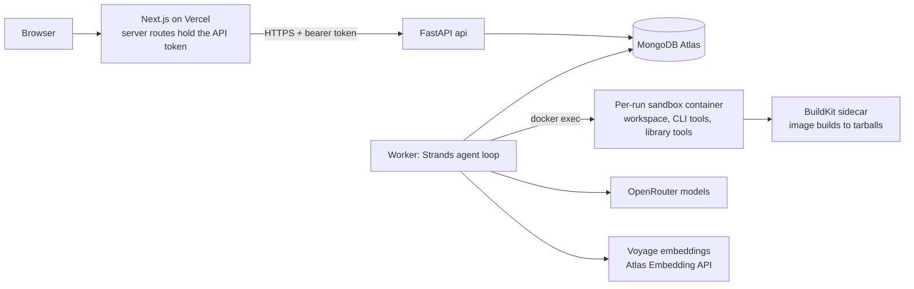

# PortPilot MVP Plan: a self-extending migration agent

Status: plan of record from 2026-09-26. It replaces the 4-hour scope in `docs/charter/PROJECT_CHARTER.md` and `docs/plan/PARALLEL_IMPLEMENTATION_PLAN.md` (v0). The v0 code on `main` (`7a970a4`) stays in place, and parts of it are reused (section 10).

## 1. The MVP in one paragraph

1. A user pastes a GitHub repo URL and a migration goal into a web app on Vercel.
2. A backend worker starts a Strands agent, which clones the repo into an isolated sandbox container and surveys it.
3. The agent writes a long-term plan (LTP), then works through many short-term plans (STPs).
4. Before every STP, the agent picks a small set of relevant tools from a tool library stored in MongoDB Atlas.
5. When no tool fits, the agent writes one, validates it in the sandbox, and adds it to the library, where later migrations can reuse it.
6. The agent can inspect its CLI environment and install CLI tools from an approved list (for Dockerfile work: Trivy, hadolint, dive).
7. After each STP, the agent records lessons learned and gotchas. These are embedded and indexed in Atlas for both semantic and full-text search.
8. It checkpoints to Atlas continuously, so a killed process resumes from the last checkpoint.
9. It compacts its own context with an LLM summarization call.

"privy" in the brief is read as **Trivy**, Aqua Security's vulnerability scanner.

### 1.1 MVP acceptance (this is the demo)

1. Paste a repo URL and a goal into the Vercel UI. The UI shows the run starting, the LTP, and the STP queue.
2. Every STP shows the tools chosen for it (at most 8 beyond the core set), the reason for each, and the tokens used.
3. **Dockerfile scenario:**
   - The agent checks its environment and installs trivy, hadolint and dive from the allow-list.
   - An install of an unlisted tool is refused.
   - The agent builds the image and reduces its size and CVE count. Both are measured before and after.
4. Run 1 creates at least one new tool (for example `dockerfile_audit`). Run 2, on a different repo, selects and reuses that tool instead of writing it again.
5. Lessons and gotchas are stored in Atlas and are searchable in the UI both by meaning and by exact keyword.
6. `kill -9` on the worker in the middle of an STP: the restarted worker resumes the same run from Atlas without redoing completed STPs.
7. A compaction event, with context tokens before and after, is visible during a long STP.

### 1.2 Non-goals for the MVP

- Private repos, and write access to GitHub such as opening PRs (see decision 4 in section 12).
- Running STPs in parallel within one run. There is one worker per run, enforced by a lease.
- CLI installs outside the allow-list, or an allow-list the agent can edit.
- Teams, per-user auth and billing. The MVP has a single shared access gate.

**Scope change against the charter.** The charter excluded arbitrary repository ingestion, arbitrary untrusted code execution, and autonomous long-running background workers. This MVP needs all three. That makes the security model in 3.9 a requirement, not optional hardening.

## 2. Architecture



**Processes:**
- `api` and `worker` are separate processes built from the same image, running on one Docker host. Restarting the API never kills a run.

**Queue and lease:**
- Runs are queued in `migration_runs`.
- A worker claims a run with an atomic `find_one_and_update` lease, heartbeats every 10 s, and holds a 60 s lease TTL.
- If the worker is killed, its run is claimed again once the TTL expires.

**Sandbox:**
- Each run gets one sandbox container and a named volume mounted at `/workspace`.
- Repo code, CLI tools and library tools execute only there.
- The worker holds the secrets and never executes repo code or code the agent wrote.

**Why the agent can't run on Vercel:**
- Vercel Functions stop after 30 minutes on Pro and 300 s on Hobby, and a migration runs for hours.
- So Vercel hosts only the UI.
- For the same reason the UI polls for events instead of holding a stream open: a stream through a Vercel function is cut off at that time limit.

## 3. Design decisions

### 3.1 Strands building blocks

All of these were confirmed to exist in the pinned `strands-agents==1.57.1`.

| Need | Strands piece | How we use it |
|---|---|---|
| Automatic compaction with an LLM call | `SummarizingConversationManager(proactive_compression={"compression_threshold": 0.7}, summarization_agent=..., pin_first=1, preserve_recent_messages=8)` | Compresses once 70% of the context window is used, with a cheap summarizer model. The STP brief (the first message) stays pinned. A subclass logs a `compaction` event with the token count before and after. |
| Large tool outputs | `ContextOffloader` plugin and the `Storage` interface (read/write/list/delete/search) | `AtlasStorage` keeps full outputs in Atlas. The context gets a preview plus a handle to retrieve the rest. |
| Durable conversation | `RepositorySessionManager` and a custom `SessionRepository` (9 methods) | `AtlasSessionRepository` saves every message and the agent state. The session id is `<run_id>.<step_id>`. |
| Sandboxed execution | `Sandbox` interface and `DockerSandbox(container, working_dir, user)` | Bound to the run's container. The built-in `shell` and `file_editor` tools route through it. |
| A tool set per STP | `Agent(tools=...)`, `ToolRegistry.register_dynamic_tool`, the `AgentTool` base class (`tool_name`, `tool_spec`, `tool_type`, `stream`) | A fresh agent per STP. Library tools are `SandboxScriptTool(AgentTool)` proxies. Loading a tool mid-STP uses `register_dynamic_tool`. |
| Guardrails | `InterventionHandler.before_tool_call` | Enforces the per-STP tool list and the call and token budgets, and refuses install-like shell commands with a pointer to `install_cli_tool`. |
| Typed LLM outputs | `structured_output_model` and `agent.structured_output` | The planner, tool selector, reflection and digest steps return validated models. |

**Not used for now:**
- `context_manager=`: it lives in a private `_context_manager` module.
- `checkpointing=`: marked experimental.
- `memory_manager=`: possible later, through an adapter for its `MemoryStore` protocol.

Everything is wrapped behind our own interfaces (section 5), so upgrading Strands touches only the adapters.

### 3.2 Two kinds of tools

**Built-in tools:**
- Python we write, reviewed and kept in this repo.
- The worker runs them because they need Atlas, the sandbox API or the installer.
- Examples: `search_tools`, `load_tool`, `create_tool`, `record_lesson`, `check_environment`, `install_cli_tool`, `complete_step`.

**Library tools:**
- Stored in the Atlas `tools` collection. They are written by the agent, or seeded by us.
- They execute only inside the run's sandbox, through a runner script: `pp-tool-run <name>@<version>` reads JSON on stdin, writes JSON on stdout, and enforces a timeout and an output cap.
- The worker never imports them. That separation is what makes running agent-written code acceptable.

### 3.3 Tool lifecycle: how the harness improves itself

A tool moves through `draft → candidate → active → deprecated`.

1. `create_tool(name, purpose, input_schema, output_schema, files, tests, requires_cli)` saves a candidate. The candidate records where it came from: the run, the step and the repo.
2. **Validation in the sandbox:**
   - syntax and lint;
   - schema checks;
   - the tool's own pytest tests;
   - one smoke call against the current workspace.
3. **Promotion gate:**
   - A candidate becomes active only if validation passes.
   - A new version of an existing tool must also pass the previous version's tests, so a new version can't break what worked.
   - This is v0's policy-promotion rule (improve, with no regressions), reused.
4. A tool card (name, description, when to use it, tags, usage stats) is embedded into `knowledge`, so the tool selector can find it.
5. **Usage stats:** uses, successes, failures, and which runs reused it. A tool whose failure rate passes a threshold becomes `deprecated`, and a gotcha is recorded explaining why.

**Toolsmith agent:**
- Writing a tool happens in a separate, small "toolsmith" agent with only `shell`, `file_editor`, `run_tool_tests` and `submit_tool`, so tool writing doesn't fill the executor's context.
- Limits: 2 new tools per STP, and 2 validation attempts per tool.

### 3.4 Planning: one long-term plan, short-term plans generated as it goes

**Survey:** the built-in `repo_map` tool records:
- languages and sizes;
- package manifests, Dockerfiles, CI configuration and test commands;
- the module and import graph.

It is saved as an artifact.

**Long-term plan:**
- The planner model writes phases, each with a goal, exit criteria and a module list, plus a list of assumptions.
- The plan is versioned in `plans`, and every revision is an event.

**Short-term plans, a few at a time:**
- The loop generates only the next 3 STPs at a time, from the LTP, the run digest and open gotchas. It never plans the whole codebase up front.
- Each STP has an objective, inputs (files or modules), acceptance checks (commands the harness runs), capability hints, and a budget in turns, tokens and minutes.
- An STP is sized to fit in one context window with at most one compaction.
- For large repos, phases follow the dependency graph starting from the modules nothing depends on.

**Verification belongs to the harness:**
- When the agent calls `complete_step`, the harness runs the acceptance checks in the sandbox.
- The agent's own claim that it's done is not trusted.

**On failure:**
1. Retry up to 2 times, with the failure recorded as a gotcha.
2. Then revise the LTP.
3. Then mark the step failed and continue, if the LTP allows it.

### 3.5 Choosing tools for each STP, keeping context small

1. Build a search query from the STP's objective, acceptance checks and capability hints.
2. Run a hybrid search over `tool_card` entries in `knowledge`, filtered to `status=active` and to the repo's language and framework. Keep the top 20, each with a one-line description and usage stats.
3. A selector call (cheap model, typed output) picks at most 8, gives a reason for each, and lists any missing capabilities.
4. For a missing capability, a toolsmith sub-step writes the tool first (3.3).
5. **Build a fresh executor `Agent`:**
   - Tools: the core tools plus the selected tools.
   - Brief: the STP, the relevant LTP excerpt, the run digest, and the 5 most relevant lessons and gotchas, capped in tokens.
6. **Mid-STP escape hatch:** the agent can call `search_tools` and `load_tool` up to 3 times per STP. Each load is logged.
7. After the STP, record which selected tools were used and whether they helped. This feeds the usage stats and the next selection.

**Core tools, present in every STP (about 11 tool definitions):**
- `shell`, `file_editor`, `complete_step`;
- `search_knowledge`, `search_tools`, `load_tool`, `create_tool`;
- `check_environment`, `install_cli_tool`;
- `record_lesson`, `record_gotcha`.

**Budget:**
- Tool definitions stay under about 6k tokens per STP.
- That size is logged on every STP, so "no context bloat" can be measured.

### 3.6 Context compaction

There are three layers:
1. **A fresh agent for every STP.** This has the largest effect. Continuity comes from the run digest, not from old messages.
2. **Summarization inside an STP.** The summarizing manager compresses once 70% of the window is used (3.1), using the cheap model, with the STP brief pinned.
3. **Offloading large outputs.** Tool outputs over 8 KB go to Atlas, and a preview stays in context.

The **run digest** carries everything between STPs. After each STP, a summarizer call rewrites it (1,500 tokens at most) to cover what is done, decisions made, and open issues. It is saved and embedded as a `run_digest` item.

### 3.7 Checkpoint and resume

**What Atlas holds:**
- **Run:** status, current step, LTP version, lease, budgets used, the manifest of installed CLIs, and the tool versions pinned for the run.
- **Step:** status (`planned → selecting_tools → running → verifying → reflecting → done | failed | skipped`), selected tools, attempts, and the workspace commit SHA.
- **Messages:** every agent message, saved through `AtlasSessionRepository`.
- **Workspace:** a git commit on branch `portpilot/<run_id>` at the end of every STP, with the SHA stored on the step.
  - For repos under 50 MB, a `git bundle` is also stored in GridFS, so a different host can resume the run.

**Resume, after a worker restart or when another worker claims the run:**
1. Take the lease.
2. `SandboxManager.ensure(run_id)` reattaches to the container, or recreates it on the same volume. It then reinstalls CLIs from the manifest; installs are idempotent.
3. Skip steps that are `done`. They are never run again.
4. **A step still `running`:**
   - If the saved conversation is consistent, resume it. A tool call cut off mid-flight gets a synthetic result: "interrupted by restart, re-check state".
   - If it isn't consistent, reset the workspace to the last completed step's SHA and restart the step.
5. **A step in `verifying` or `reflecting`:** redo only that phase. Its writes are keyed by step id, so repeating them is safe.

**Pause and cancel** from the UI set a flag that the loop checks between tool calls.

### 3.8 Sandbox and CLI environment

**Image (`portpilot-sandbox`, Debian slim):**
- Contents: git, curl, CA certificates, python3 with uv and pytest, node with npm, and the tool runner.
- It runs as a non-root user, with the `/workspace` volume and CLIs under `/opt/pp/tools`.

**Container limits:**
- Caps on CPU, memory, process count and disk.
- No Docker socket and no secrets in the environment.
- Network access is needed only for cloning, installs and package registries. The MVP uses the default network; restricting outbound traffic at the host is a stretch goal.

**`check_environment`** reports:
- OS and architecture;
- installed CLIs and their versions;
- free disk and memory;
- the languages found in the repo.

**`install_cli_tool(name)`:**
- It accepts only names listed in `config/cli_allowlist.yaml`. That file is reviewed by a human and read-only to the agent.
- Each entry has a pinned version, a download URL per architecture, a sha256, an install method and a verify command.
- Installs are recorded on the run. Anything not listed is refused and logged as `cli_refused`.

**Initial allow-list:**
- trivy, hadolint, dive, syft, grype, dockle;
- crane, for reading remote image metadata without a Docker daemon;
- jq, yq, ripgrep, shellcheck.

Adding a tool to the list is a reviewed change.

**Image builds:**
- A rootless BuildKit sidecar runs on each host.
- The built-in `build_image` tool builds to an OCI tarball in the workspace, and trivy and dive analyze the tarball.
- The sandbox never gets access to the host Docker daemon.

### 3.9 Security model (required)

**What is untrusted:**
- The repo and its build scripts, downloaded CLI binaries, and tools the agent writes.
- All of it runs only in the per-run container.

**The worker:**
- It holds the secrets (Atlas URI, OpenRouter key, Voyage key).
- It runs only Python that is committed in this repo.

**The API:**
- Every route except `/health` requires a bearer token.
- The token exists only in Vercel's server-side environment.
- CORS is limited to the Vercel domain, and run creation is rate-limited per token.

**The UI needs an access gate.** Without one, anyone with the URL can start runs that execute code on our host and spend our credits. Use Vercel Deployment Protection, or a shared passcode checked in Next.js middleware.

**Repo URLs:**
- Only `https://github.com/<owner>/<repo>` for public repos.
- Shallow clone, 200 MB size cap, and a clone timeout.

**Agent limits:**
- The agent can't change the allow-list or the core prompts.
- Promoting a tool never widens its permissions: every library tool gets the same sandbox and nothing more.

**Host:** run the backend on a dedicated, disposable VM with no other credentials on it.

### 3.10 Knowledge: lessons, gotchas, memory and tool cards

**One `knowledge` collection** holds everything searchable:
- Kinds: `lesson`, `gotcha`, `memory`, `tool_card`, `run_digest`.
- Fields: title, body, tags, facets (language, framework, ecosystem, tool), source (run, step, repo), `seen_count`, status, and embedding.

**Why one collection:**
- The free M0 tier allows 3 search indexes per cluster, counting search and vector indexes together.
- We use 2:
  - `knowledge_text`: Atlas Search over title and body with the standard analyzer, and tags as keywords.
  - `knowledge_vec`: a vector index on `embedding`, with filter fields `kind`, `status` and the facets.
- One index slot stays free.

**Embeddings:**
- Voyage `voyage-4`, called through the Atlas Embedding API (`https://ai.mongodb.com/v1/embeddings`), using a model API key created in the Atlas UI. `input_type` is `document` when storing and `query` when searching.
- The vector size is fixed when the index is created; spike S1 confirms the default.
- Atlas Automated Embedding (the `autoEmbed` index type) is labeled Preview in the docs. Use it only if S1 shows it works on our cluster tier.

**Hybrid search:**
- `$rankFusion` over a `$vectorSearch` pipeline and a `$search` pipeline.
- The cluster runs MongoDB 8.0.32 and accepts `$rankFusion`. S1 checks whether it also accepts `$vectorSearch` inside it on 8.0.
- Fallback: reciprocal-rank fusion done by hand with `$unionWith`, which works on any version.

**Search modes** available to the agent and the UI: `hybrid` (the default), `vector` and `text`.

**Deduplication:** before inserting, search the same kind by vector. If an entry is at least 0.92 similar, merge into it (increment `seen_count` and add the source) instead of inserting a copy.

**Readable copies:**
- `.portpilot/LESSONS.md`, `.portpilot/GOTCHAS.md` and `.portpilot/MEMORY.md` are written into the workspace at the end of every STP.
- Atlas stays the source of truth.

**Local tests:**
- The `mongodb/mongodb-atlas-local` image (mongod plus mongot) supports both index types.
- Today the `mongo:8.0` image refused to start on this Docker VM's kernel (6.19 or newer). S1 must find an atlas-local tag that starts.

**Storage cap:** M0 allows 512 MB.
- `events` and `agent_messages` for finished runs get a TTL (default 14 days).
- Artifacts over 1 MB go to GridFS, with a cap per run.

### 3.11 Models

- **Executor and planner:** `anthropic/claude-sonnet-4.5` through OpenRouter. Its tool calling was verified today.
- **Selector, reflection, digest and summarizer:** a cheaper model chosen in S2. It must pass both a typed-output check and a summary-quality check.
- **Settings:** `MODEL_ID` and `MODEL_ID_AUX`, with temperature 0.1 for planning and selection.

## 4. Data model (Atlas)

| Collection | Purpose | Key fields | Indexes |
|---|---|---|---|
| `migration_runs` | One per run | repo_url, goal, status, current_step_id, ltp_version, lease{owner, expires_at}, budgets, usage, cli_manifest, tool_pins | status + lease.expires_at; created_at |
| `plans` | LTP versions | run_id, version, phases[], assumptions | (run_id, version) unique |
| `steps` | STPs | run_id, seq, phase_id, objective, acceptance[], status, selected_tools[], attempts, commit_sha, outcome, usage | (run_id, seq) unique |
| `tools` | Library tool versions | name, version, status, spec, files, tests, requires_cli, provenance, stats | (name, version) unique; status |
| `knowledge` | Everything searchable | kind, title, body, tags, facets, source, seen_count, embedding | `knowledge_text`, `knowledge_vec`; kind |
| `events` | Timeline | run_id, seq, ts, type, step_id, payload | (run_id, seq) unique; TTL |
| `artifacts` | Reports, large outputs | run_id, step_id, kind, content or gridfs_id | (run_id, kind) |
| `agent_sessions`, `agent_messages` | Strands session repository | session_id, agent_id, message_id | unique keys; TTL |
| `offload` | ContextOffloader storage | key, value | key unique |

The v0 collections (`milestones`, `policies`) stay until v0 is retired.

**Event types:**
- **Run and lease:** `run_created`, `lease_acquired`, `resumed`, `paused`, `completed`, `failed`.
- **Plans and steps:** `plan_created`, `plan_revised`, `step_planned`, `step_verified`.
- **Tools:**
  - calls: `tools_selected`, `tool_loaded`, `tool_call`, `tool_result`, `tool_error`;
  - lifecycle: `tool_created`, `tool_validated`, `tool_promoted`, `tool_rejected`, `tool_deprecated`.
- **CLI environment:** `cli_checked`, `cli_installed`, `cli_refused`.
- **Agent state and knowledge:** `compaction`, `checkpoint`, `lesson_recorded`, `gotcha_recorded`.

## 5. Frozen interfaces (the Lead writes these in Phase 0; only the Lead changes them)

`src/portpilot/core/models.py` uses plain dataclasses with `to_doc` and `from_doc`, like v0. `src/portpilot/core/interfaces.py` holds the protocols:

```python
RunStatus = Literal["queued", "running", "paused", "completed", "failed", "cancelled"]
StepStatus = Literal["planned", "selecting_tools", "running", "verifying", "reflecting",
                     "done", "failed", "skipped"]
KnowledgeKind = Literal["lesson", "gotcha", "memory", "tool_card", "run_digest"]
ToolStatus = Literal["draft", "candidate", "active", "deprecated"]
SearchMode = Literal["hybrid", "vector", "text"]

# Dataclasses: Run, Phase, LongTermPlan, Check(name, command, expect_exit=0, timeout_s=600),
# ToolPick(name, version, reason), ShortTermPlan, ToolRecord, ToolCard, KnowledgeItem,
# Hit(item, score, via), InstallResult, ValidationReport, PromotionDecision

class RunStore(Protocol):                    # Lane M
    def create_run(self, repo_url: str, goal: str, budgets: dict) -> str: ...
    def claim_run(self, worker_id: str, lease_s: int = 60) -> Run | None: ...
    def heartbeat(self, run_id: str, worker_id: str) -> bool: ...        # False = lease lost
    def get_run(self, run_id: str) -> Run: ...
    def update_run(self, run_id: str, **fields: Any) -> None: ...
    def save_plan(self, plan: LongTermPlan) -> None: ...
    def latest_plan(self, run_id: str) -> LongTermPlan | None: ...
    def save_step(self, step: ShortTermPlan) -> None: ...
    def update_step(self, step_id: str, **fields: Any) -> None: ...
    def steps(self, run_id: str) -> list[ShortTermPlan]: ...
    def log_event(self, run_id: str, type: str, step_id: str | None, payload: dict) -> int: ...
    def events(self, run_id: str, after_seq: int = 0, limit: int = 200) -> list[dict]: ...
    def put_artifact(self, run_id: str, step_id: str | None, kind: str, content: Any) -> str: ...
    def get_artifact(self, artifact_id: str) -> dict: ...

class ToolStore(Protocol):                   # Lane M persistence; Lane T owns the logic on top
    def save(self, record: ToolRecord) -> None: ...
    def get(self, name: str, version: int | None = None) -> ToolRecord: ...   # None = active
    def versions(self, name: str) -> list[ToolRecord]: ...
    def set_status(self, name: str, version: int, status: ToolStatus) -> None: ...
    def record_use(self, name: str, version: int, run_id: str, step_id: str, ok: bool) -> None: ...

class Embedder(Protocol):                    # Lane K
    model: str
    dims: int
    def embed(self, texts: list[str], input_type: Literal["document", "query"]) -> list[list[float]]: ...

class KnowledgeStore(Protocol):              # Lane K
    def upsert(self, item: KnowledgeItem, dedupe: bool = True) -> str: ...
    def search(self, query: str, *, kinds: list[KnowledgeKind] | None = None,
               mode: SearchMode = "hybrid", filters: dict | None = None,
               limit: int = 8) -> list[Hit]: ...

class SandboxManager(Protocol):              # Lane S
    def ensure(self, run_id: str, repo_url: str) -> str: ...          # container id; create or reattach
    def sandbox(self, run_id: str) -> "strands.sandbox.Sandbox": ...
    def commit(self, run_id: str, message: str) -> str: ...           # workspace git SHA
    def restore(self, run_id: str, sha: str) -> None: ...
    def destroy(self, run_id: str) -> None: ...

class CliInstaller(Protocol):                # Lane S
    def check_environment(self, run_id: str) -> dict: ...
    def install(self, run_id: str, name: str) -> InstallResult: ...   # allow-list only

class ToolLibrary(Protocol):                 # Lane T
    def propose(self, draft: ToolRecord, run_id: str, step_id: str) -> ToolRecord: ...
    def validate(self, name: str, version: int, run_id: str) -> ValidationReport: ...
    def promote(self, name: str, version: int) -> PromotionDecision: ...
    def candidates(self, query: str, filters: dict | None = None, limit: int = 20) -> list[ToolCard]: ...
    def as_agent_tool(self, record: ToolRecord, run_id: str) -> "strands.types.tools.AgentTool": ...
```

**API contract** (`src/portpilot/api/schemas.py`):
- **Generated contract:** FastAPI writes `docs/api/openapi.json`, and `web/` generates TypeScript types from it.
- **Auth:** every route except `/api/health` needs `Authorization: Bearer <PORTPILOT_API_TOKEN>`.

**Runs:**
- `POST /api/runs {repo_url, goal}` returns `{run_id}`.
- `GET /api/runs` lists runs.
- `GET /api/runs/{id}` returns the run, its LTP and a summary of its steps.
- `GET /api/runs/{id}/steps/{step_id}` returns one step.
- `GET /api/runs/{id}/events?after_seq=&limit=` returns events after a cursor; the UI polls it every 2 s.
- `POST /api/runs/{id}/pause`, `/resume` and `/cancel` control the run.
- `GET /api/runs/{id}/artifacts/{artifact_id}` returns one artifact.
- `GET /api/runs/{id}/download` returns a tar.gz of the workspace branch.

**Tools and knowledge:**
- `GET /api/tools` lists library tools.
- `GET /api/tools/{name}` returns a tool's versions, stats and origin.
- `GET /api/knowledge/search?q=&kinds=&mode=` searches lessons, gotchas and other knowledge.

## 6. Repository layout and ownership

```
src/portpilot/
  core/        models.py, interfaces.py, config.py, events.py               Lead
  store/       Store v2, leases, strands_adapters.py (SessionRepository, Storage)   Lane M
  knowledge/   embedder.py, store.py, search.py, indexes.py, render.py      Lane K
  sandbox/     manager.py, installer.py, allowlist.py, runner/pp_tool_run.py      Lane S
  toollib/     library.py, proxy.py, toolsmith.py, validation.py, builtins/, seeds/   Lane T
  agent/       loop.py, survey.py, planner.py, selector.py, executor.py, verify.py,
               reflect.py, digest.py, compaction.py, interventions.py, prompts/   Lane A
  api/         app.py, schemas.py, auth.py, routes/                          Lane P
  worker/      main.py                                                       Lane P
  cli.py       operator commands (worker, runs, tools, knowledge search)     Lead
  harness/, contracts/   v0; runner reused by Lane T, retired after Sync 2
config/cli_allowlist.yaml    human-reviewed                                  Lane S
docker/sandbox/Dockerfile                                                    Lane S
deploy/      docker-compose.yml, Caddyfile, VM runbook                       Lane P
web/         Next.js app, Vercel project root                                Lane F
evals/       fixture repos, scenarios, chaos script, metrics                 Lane E
tests/<lane>/                                                                each lane
```

**Test markers:**
- `unit`: the default; uses fakes.
- `mongo`: local `mongo:8.2` on port 27018.
- `atlas_local`: search tests on port 27019.
- `docker`: sandbox tests.
- `llm`: calls OpenRouter; run manually.
- `live_atlas`: uses the real cluster; run manually.
- `chaos`: the kill-and-resume test.

A plain `uv run pytest` stays offline and fast.

**Ports:**
- API: 8000.
- Worker health: 8001.
- Next.js dev server: 3000.
- Lane M test Mongo: 27018.
- Lane K atlas-local: 27019.

**Container names:**
- Sandbox containers: `pp-sbx-<run_id>`.
- Lane test containers: `pp-test-<lane>-*`.

## 7. Phases, sync points and acceptance

Rough wall-clock estimates with parallel lanes: Phase 0 about 2 h, Phase 1 about 4–6 h, Phase 2 about 3–4 h, Phase 3 about 2–3 h.

### Phase 0: interfaces and spikes (Lead plus 3 spike subagents)

**Step 0a, in parallel:**
- Three spike subagents run S1–S3 in throwaway worktrees and report findings only.
- Meanwhile the Lead drafts:
  - the charter change;
  - `core/` (models and interfaces);
  - fakes: `InMemoryRunStore`, `FakeEmbedder`, `FakeSandbox`, a scripted fake model;
  - API schemas and lane briefs.

**The spikes:**
- **S1, Atlas:**
  - Create `knowledge_text` and `knowledge_vec` on a scratch collection in the real cluster, then drop them.
  - Test `$rankFusion` with `$vectorSearch` and `$search` on 8.0.32, and test the manual reciprocal-rank-fusion fallback.
  - Embed 3 texts with `voyage-4` through the Atlas Embedding API and confirm the vector size.
  - Check whether `autoEmbed` works on our tier.
  - Find an atlas-local image tag that starts on this Docker VM.
- **S2, Strands:**
  - Build an agent per STP with a tool registered at runtime.
  - Confirm proactive compression fires on a deliberately long conversation.
  - Prototype `AtlasSessionRepository`: kill the process mid-conversation, then resume.
  - Test typed output with 2 candidate cheap models on OpenRouter.
  - Measure how many tokens the core tool definitions cost.
- **S3, sandbox:**
  - Build `portpilot-sandbox` and run commands through `DockerSandbox`.
  - Install trivy, hadolint and dive at pinned versions with checked sha256 sums.
  - Build a sample Dockerfile to a tarball with rootless BuildKit, then scan it with trivy and dive.
  - Confirm no Docker socket is needed.

**Step 0b:**
- The Lead writes the spike decisions into section 12 and finalizes `core/`.
- The Lead commits `core/`, the fakes and briefs in `docs/plan/mvp-lanes/lane-*.md` to `main`, then creates the lane worktrees.

### Phase 1: the lanes (section 8)

- **Wave 1**, right after 0b: lanes M, K, S, E and F. The Lead starts lane A.
- **Wave 2**, once M and S are merged: lanes T and P.

### Phase 2: integration slices, led by the Lead with lane owners on call

- **Slice 1 → Sync 2:** a tiny repo goes end to end.
- **Slice 2 → Sync 3:** the Dockerfile scenario, then tool reuse on a second repo.
- **Slice 3 → Sync 4:** kill and resume, compaction, and knowledge search in the UI.

### Phase 3: deploy and rehearse

- **Backend:** deploy to a VM with Docker Compose and Caddy for TLS.
- **Frontend:** set up the Vercel project (root `web/`) with its environment variables and the access gate.
- **Demo:** write `docs/DEMO_MVP.md` and rehearse it twice.

| Sync | Scenario | Must show |
|---|---|---|
| 1 (end of Phase 1) | `uv run pytest`, each lane's "Done" check | Everything green on fakes; atlas-local search tests green; ruff clean |
| 2 | Submit a tiny repo in the UI | LTP plus at least 3 STPs, each with at most 8 selected tools and reasons; events in Atlas; lessons written |
| 3 | E2 Dockerfile repo, then E3 | trivy, hadolint and dive installed from the allow-list; one unlisted install refused; image size and CVE counts before and after; at least one tool created in run 1 and reused in run 2 with no duplicate |
| 4 | `kill -9` the worker mid-STP, then restart it | The same run resumes; completed STPs are not re-run; at least one compaction event with before and after token counts; hybrid, vector and text search each find the seeded gotcha |
| Final | Deployed on Vercel and the VM | The demo passes twice in a row |

## 8. Lanes

Each lane lists what it owns, what it builds, and its "Done" check, which is also its stop condition. A lane edits only the paths it owns.

### Lane M: Mongo state (Wave 1)

**Owns:** `store/` (v2), including `store/strands_adapters.py`.

**Builds:**
- Run, plan, step, tool, event and artifact stores, in-memory and Atlas, following v0's async pattern: `AsyncAtlasStore` plus a sync wrapper on a loop thread.
- Lease claim, heartbeat and release.
- Unique indexes and TTL indexes.
- `AtlasSessionRepository` and `AtlasStorage` (the Strands adapters).
- GridFS helpers for artifacts and workspace bundles.

**Done:**
- A parametrized contract test suite passes on both the in-memory and local Mongo stores.
- Lease test: of two claimers, exactly one wins, and the run is claimed again after the lease expires.
- Strands session round trip: messages written by one process are restored identically in a new one.

### Lane K: Knowledge and retrieval (Wave 1)

**Owns:** `knowledge/`.

**Builds:**
- **Embedders:** `VoyageEmbedder` (Atlas Embedding API) and a deterministic `FakeEmbedder`.
- **Setup:** the index definitions and `portpilot knowledge init-indexes`.
- **Store and search:** `upsert` with deduplication, and search in hybrid, vector and text modes, using `$rankFusion` or the manual fallback depending on S1.
- **Output:** the markdown renderers.
- **Optional:** a Strands `MemoryStore` adapter.

**Done (atlas-local tests):**
- An exact-keyword query finds its item through text search.
- A paraphrased query finds its item through vector search.
- Hybrid search ranks both.
- Near-duplicates are merged.
- One live probe against the real Atlas indexes passes.

### Lane S: Sandbox and CLI environment (Wave 1)

**Owns:** `sandbox/`, `config/cli_allowlist.yaml`, `docker/sandbox/`.

**Builds:**
- The sandbox image and `SandboxManager` (create, reattach, limits, volume, destroy).
- `DockerSandbox` wiring, and git commit and restore of the workspace.
- The tool runner (`pp_tool_run.py`).
- `check_environment` and `install_cli_tool`: pinned, checksum-verified, per architecture, idempotent, recorded in a manifest.
- The BuildKit sidecar and `build_image`.
- Patterns that detect install commands in shell calls, used by the intervention.

**Done (`docker` tests):**
- The container survives a worker restart and is reattached.
- trivy, hadolint and dive install and run.
- An unlisted name is refused, and a checksum mismatch is refused.
- A sample Dockerfile builds to a tarball, and the tarball is scanned.
- Workspace commit and restore round-trips.

### Lane T: Tool library and agent-written tools (Wave 2)

**Owns:** `toollib/`.

**Builds:**
- `ToolLibrary`: propose, validate, promote, deprecate, record use.
- The `SandboxScriptTool` proxy.
- The toolsmith agent and the `create_tool` flow.
- Tool cards written to `knowledge`, and usage stats.
- **Seed tools:**
  - `repo_map` and `run_checks`;
  - `http_contract_diff`, a port of v0's contract runner;
  - a Dockerfile facts extractor.

**Done:**
- An agent-written tool completes the round trip in the sandbox: candidate, validated, active, then its card is searchable.
- A new version that breaks the previous version's tests is rejected.
- A Strands agent running on a fake model can call the proxy.
- A test asserts that library tool code is never imported by the worker.

### Lane A: Agent core (the Lead, human-supervised; critical path)

**Owns:** `agent/`.

**Builds:**
- The run loop state machine.
- Survey, the planner, and the STP generator.
- The tool selector and the executor factory.
- Interventions (the per-STP tool list and budgets), and the verification runner.
- Reflection into lessons and gotchas, and the run digest.
- The compaction subclass and the offloader wiring.
- The resume algorithm, and pause and cancel.

**Done:**
- Offline end-to-end run with a scripted fake model and a fake sandbox: LTP, 3 STPs, tools selected, a lesson written, checkpoints.
- A resume works after a simulated crash at every step status.
- A live end-to-end run on a tiny repo through OpenRouter.

### Lane P: API, worker and deployment (Wave 2)

**Owns:** `api/`, `worker/`, `deploy/`.

**Builds:**
- The FastAPI app, following the API contract: bearer auth, CORS, rate limiting, event polling, and the download endpoint.
- The worker: claim a run, heartbeat its lease, run the loop, shut down cleanly.
- Deployment: Compose (api, worker, buildkit), the Caddy config, and the VM runbook.

**Done:**
- API contract tests pass against the in-memory store.
- Every route except `/health` rejects requests without a token.
- A test with a fake loop shows a restarted worker reclaims the run after the TTL.
- `docker compose up` works locally.

### Lane F: Frontend (Next.js on Vercel, Wave 1)

**Owns:** `web/`.

**Builds:**
- **New run form.**
- **Run page:**
  - the LTP and STP tree;
  - the current STP with its tools, reasons and tokens;
  - the live timeline, CLI installs, and tools created or reused;
  - lessons and gotchas, compaction events, and a download link.
- **Tools library page.**
- **Knowledge search page** with a mode toggle.
- **Server-side route handlers** that hold the token and proxy to the API, plus the access gate.

Until lane P lands, it builds against recorded JSON fixtures. Accessibility: labelled controls, keyboard navigation, sufficient contrast, and `aria-live` on the timeline.

**Done:**
- `npm run build`, lint and component tests pass.
- It works against the fixtures and against a local API.
- A Vercel preview deploys.

### Lane E: Evals and fixture repos (Wave 1)

**Owns:** `evals/`.

**Builds:**
- **Fixture repos, published as public repos under your GitHub account:**
  - **E1:** the v0 Flask profile API, with its contract checks.
  - **E2:** a small service with a bloated Dockerfile, on an old base image with known CVEs, without a multi-stage build.
  - **E3:** a second service with a similar Dockerfile, for the reuse test.
- **Scripts:**
  - a scenario runner that submits runs through the API and checks the Sync 3 and Sync 4 metrics;
  - a chaos script that runs `kill -9` mid-STP.
- **Metrics report:** tokens per STP, tokens spent on tool definitions, tools created against tools reused, and compaction count.

**Done:**
- The fixture repos exist, with baseline measurements recorded: image size, CVE count and hadolint findings.
- The scenario scripts run against a fake backend.

## 9. Running the lanes with subagents

1. **Phase 0a:**
   - For each spike, create a worktree: `git worktree add ../portPilot-spike-s<n> -b spike/s<n>`.
   - Start all three with `spawn_run`, using `include_memory=false` and `include_lessons=true`.
   - Each task gives the worktree path. Spikes load `.env` from the main checkout by absolute path and never print secret values.
   - The Lead drafts `core/` in the meantime, and waits for all three results before 0b.
2. **Phase 0b:**
   - The Lead commits `core/`, the fakes and the lane briefs to `main`.
   - Each brief is its lane's part of section 8, plus the interfaces it touches and its test commands.
   - Then create each lane worktree from that commit: `git worktree add ../portPilot-mvp-<lane> -b mvp/<lane>`.
3. **Starting lanes:**
   - Start each lane with its own `spawn_run`, with `cwd` set to its worktree, so the project instructions load from there.
   - Check `resource_status` before each wave. Run at most 5 subagents at once, to leave headroom for Docker.
4. **Each lane's task text** contains:
   - the path to its brief, the paths it owns and the paths it must not touch;
   - its "Done" check and its test commands;
   - these stop conditions:
     - "If an interface in `core/` has to change, stop and report; don't edit it."
     - "Commit locally on your branch; never push; never read or print `.env` values."
5. **While the lanes run:**
   - The Lead builds lane A, and answers interface questions by updating `core/` on `main` and telling the affected lanes to rebase.
   - The Lead doesn't poll the subagents.
6. **Merging:**
   - For each finished lane, run its tests in its worktree and read the diff.
   - Merge with `--no-ff` into `main`, in the order M → K → S → E → F, then T → P.
   - Run the full `pytest` and `ruff` after every merge.
7. **Wave 2:** once M and S are merged, create the T and P worktrees from the updated `main` and start them.
8. **Fixes during integration:** use `spawn_continue` on the finished lane's conversation, so it keeps its context, instead of starting a new agent.
9. **No shared writers:** two agents never write the same path. F and E never touch Python packages, and T and A share only the `core/` interfaces.

## 10. What we keep from v0

| v0 piece | Reused as |
|---|---|
| `store/atlas.py` async pattern (`AsyncAtlasStore` plus the sync wrapper on a loop thread) | The template for Store v2 (lane M) |
| Contract runner and `services.py` | The library tool `http_contract_diff` (lane T) |
| Flask fixture and contract cases | Eval repo E1 (lane E) |
| Policy promotion rule (improve, no regressions) | The tool version promotion gate (lane T) |
| Typer CLI | The operator CLI |

The fixed-milestone `harness/` is retired after Sync 2, and `policies/` is replaced by the tool library.

## 11. Risks and decided fallbacks

| Risk | Trigger | Fallback |
|---|---|---|
| `$vectorSearch` not allowed inside `$rankFusion` on 8.0 | S1 | Manual reciprocal-rank fusion with `$unionWith`, behind the same `search()` API |
| No atlas-local image starts on this Docker VM's kernel | S1 | Try a newer tag; otherwise run search tests on the real cluster, sharing the 2 indexes through a namespace filter field |
| M0 limits (3 search indexes, 512 MB) | S1 or Sync 3 | One knowledge collection, TTLs and GridFS caps; upgrade to Flex if still short |
| Agent-written tools keep failing validation | 2 failed attempts | Record a gotcha and continue with `shell`; the failure goes into the toolsmith prompt |
| Selector misses a needed tool | A missing capability during an STP | `search_tools`/`load_tool` (up to 3); the miss is logged and fed into the next selection |
| Compaction loses key facts | Acceptance fails after a compaction | Brief stays pinned; raise `preserve_recent_messages`; the digest carries decisions |
| Rootless BuildKit needs privileges the host lacks | S3 | A narrower seccomp profile; as a last resort, the host daemon on the disposable VM only, with the risk written down |
| Runs too slow or expensive | Budgets exceeded in rehearsal | Smaller demo repos, a cheaper secondary model, fewer STPs per phase |
| Resuming after a kill leaves the workspace inconsistent | Sync 4 | Reset to the last STP commit and redo the step, which is always safe |
| Strands API changes | An upgrade | Pin 1.57.1; public APIs only, behind our interfaces |
| OpenRouter tool calling is flaky | S2 or during runs | Strands retry strategy and a fallback model list |

## 12. Open decisions (defaults apply unless changed)

1. **Backend host:** a disposable Linux VM with Docker and Caddy (for example, EC2). A laptop plus Cloudflare Tunnel is for development only.
2. **Voyage key:** create a Model API key in the Atlas UI and add it to `.env` as `VOYAGE_API_KEY`. S1 needs it.
3. **Cluster tier:** M0 is enough if we stay within 2 search indexes and 512 MB. Upgrade to Flex if S1 or Sync 3 hits a limit.
4. **Output:** a downloadable tarball plus a diff view in the UI. Opening GitHub PRs comes later; it needs a GitHub App token, which is write access and a high-risk permission.
5. **Tool promotion:** automatic, gated by tests. A UI switch can require human approval.
6. **Repo limits:** public GitHub repos up to 200 MB.
7. **Cheap model:** chosen in S2.

Spike decisions (recorded 2026-09-26 in Phase 0b; full detail in `docs/spikes/S*.md`):

**S1: Atlas**
- **Hybrid search:** use native `$rankFusion`. It accepts `$vectorSearch` and `$search` on 8.0.32. The manual reciprocal-rank-fusion fallback is kept.
- **Embeddings:** `voyage-4` at 1024 dimensions.
  - The user's key is a direct Voyage AI key. It is rejected by `ai.mongodb.com` (403) and accepted by `https://api.voyageai.com/v1/embeddings` (verified live).
  - Embeddings are computed on our side. `autoEmbed` builds on M0, but it isn't used.
- **Local testing:** `mongodb/mongodb-atlas-local:latest` (8.3.11) starts on this host. Use port 27019 with `directConnection=true`.

**S2: Strands**
- **Loading tools while the agent runs:** `agent.tool_registry.register_dynamic_tool(tool)`.
- **Guardrails:** attach them with `Agent(interventions=[...])`.
- **Compaction:** `context_window_limit` is a top-level `OpenAIModel` config setting.
  - Set it for every model; proactive compression depends on it.
  - The pinned first message survived every compaction.
- **Token cost:** the 11 core tool definitions cost 1,282 input tokens.
- **Offloading large outputs:** `ContextOffloader` from `strands.vended_plugins.context_offloader`, with a `Storage` that has 5 methods.
- **Resume after `kill -9`:** Strands repairs a tool call that was cut off, the next time the agent runs. No manual repair is needed.
- **Cheaper model for side tasks:** `google/gemini-2.5-flash-lite`.

**S3: Sandbox**
- **Hardened container:** `debian:bookworm-slim` pinned by digest; read-only root filesystem, all capabilities dropped, no-new-privileges, CPU/memory/process limits, and no Docker socket.
- **Tool names:** the sandbox tools are `sandbox_shell` and `sandbox_file_editor`.
- **Image builds:** rootless BuildKit `v0.33.0` needs `--privileged` on Docker Desktop.
  - It runs as a sidecar, isolated from the sandbox, which reaches it over TCP.
  - This is acceptable only on the disposable VM.
- **Archive format:** trivy and dive need docker-archive output.
- **Sample image, before and after optimization:**
  - size: 368.7 MB → 48.0 MB;
  - CRITICAL CVEs: 228 → 9;
  - HIGH CVEs: 2391 → 111.
- **Not yet verified:** git checkpoint and restore inside the container. Lane S verifies it.
